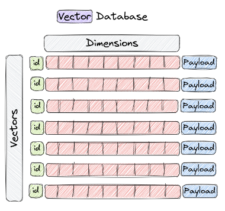

# Image Similarity Search Application with Qdrant  

## What is a Vector Database?  

A Vector Database is a new type of database designed to store and query high-dimensional data representation derived from ML models like Neural Networks.

These data representations are often called Vectors or Embeddings, and they are used to train ML models for different tasks like Sentiment Analysis & Object Detection.

Vector databases are optimized for storing and querying these high-dimensional vectors efficiently, and they often use specialized data structures and indexing techniques such as Hierarchical Navigable Small World (HNSW) – which is used to implement Approximate Nearest Neighbors.

Qdrant uses a custom version of HNSW, **filterable HNSW** with support for payload based filter.

These databases enable fast similarity and semantic search while allowing users to find vectors that are the closest to a given query vector, based on some distance metric. 

The most commonly used distance metrics are Euclidean Distance, Cosine Similarity, & Dot Product.

Vector databases have gained popularity for its applications in Retrieval Augmented Generation (RAG), Semantic Search & Recommendation Systems.

## Why do we need Vector Databases?  

Vector databases are essential in applications needing similarity search, like LLMs, Recommendation Systems, Content-Based Image Retrieval, and Personalized Search. 

They leverage efficient indexing and searching methods to swiftly and accurately retrieve unstructured data represented as vectors. 

This capability ensures users receive the most relevant results promptly.

## About Qdrant  

Qdrant is a **Vector Similarity Search Engine**, aka **VectorDB**.

Its Open-Source (Apache 2.0) & written in **Rust**.

Can use the cloud offering or the docker version in local with memmap/in-memory storage.

## Vector Payload  

In Qdrant, you can attach additional data to the vector.

A point (vector) has an id, vector & payload.

**Payload** is a **JSON object** that stores additional data related to the vector. E.g. text keyword, numeric, geo-coordinates etc.

We can use Payload to filter vectors during a query.

## Qdrant Architecture  

On a high-level, these are the main components in Qdrant.

Collections are a named set of points (vectors) among which you can search.

The vector of each point within the same collection must have the same dimensionality and be compared by a single metric.

Distance Metrics are used to measure similarities among vectors and must be selected when you create the collection. 

The choice of metric depends on the encoder used.

Points are the central entity in Qdrant, and they consist of a **vector**, an **id** & a **payload**.

An **id** a unique identifier for your **vector**.

A **Vector** is a high-dimensional representation of data, for example, an image, a sound, a document, a video, etc.

A **Payload** is a JSON object with additional data you can add to a vector.

In local, Qdrant can use one of two options for storage, In-memory storage (in RAM) or Memmap storage (in disk).

Alternatively, you can have the service running in Qdrant cloud and access it via API.

## References

[Qdrant Documentation](https://qdrant.tech/documentation/concepts)  
[(YouTube) Qdrant Vector Search in Rust by Arnaud Gourlay](https://www.youtube.com/watch?v=2cGM1fEbWJQ)  
[(YouTube) Qdrant: Open Source Vector Search Engine and Vector Database by Andrey Vasnetsov](https://www.youtube.com/watch?v=bU38Ovdh3NY)
